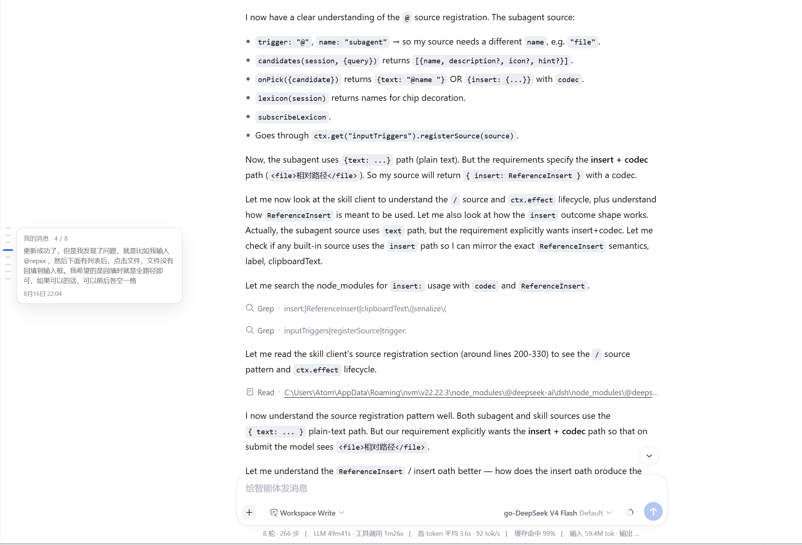

# 用户消息导航条 · Message Minimap

<div align="center">
  <b>中文</b> · <a href="README.en.md">English</a>
</div>

> **在 DeepSeek Harness Web GUI 会话聊天窗的左边缘显示一条迷你导航条：每一条你发送的消息都是刻度，悬停看摘要，点击即跳转，拖动可快速扫读长会话。**

[](LICENSE)

---

## 1. 它解决了什么问题

长会话里想回看"我之前是怎么说的"时，只能一路滚轮硬翻。AI 的回复往往又长又密，自己发过的消息被埋在中间很难找。

本插件在聊天窗**左边缘**加一条细导航条（类似 VS Code 的 minimap）：

```
聊天滚动窗 (overflow-y: auto，长会话分页加载)
  │  每条用户消息 = 一个刻度（含未加载的历史，来自会话日志）
  │  视口内的消息刻度 = 加粗高亮
  │
  ▼  悬停刻度 → 预览卡片（第几条 / 共几条 + 消息摘要 + 时间行）
  ▼  点击刻度 → 平滑滚动到该消息（未加载的先自动向上翻页）
  ▼  点击/拖动轨道 → 按比例跳转
```

**只读**：客户端只读取浏览器中已渲染的会话 DOM（聊天节点带有稳定的 `data-chat-flow-kind` / `data-chat-flow-key` 锚点），滚动的是既有的聊天滚动容器；宿主半部只新增一个**只读路由** `GET /api/message-minimap-messages`，从会话日志（`$DSH_HOME/sessions`）提取全量用户消息的**摘要**（每条最多 140 字符 + 时间戳），用于覆盖"加载更多"还没渲染的历史刻度。不修改、不删除任何文件。

## 2. 功能特性

- ✅ 聊天窗左侧一条**紧凑居中**的导航条（不铺满全高），不干扰布局。
- ✅ **每条用户消息一个刻度**，在刻度列上均匀分布（上旧下新），不随消息长短散开。
- ✅ **长会话分页也不怕**：刻度覆盖**全部**用户消息（含"加载更多"未渲染的历史，数据来自会话日志）；点击未加载的刻度会**自动向上翻页**，加载到后平滑跳转。
- ✅ **当前视口内的消息刻度自动加粗高亮**，随滚动实时更新。
- ✅ **鼠标扫过刻度列时鱼眼放大**：指针下的刻度变得最长，邻近刻度按距离渐次微长（余弦衰减 + CSS 过渡），一眼定位。
- ✅ **悬停刻度**弹出预览卡片：`我的消息 · 3 / 12` + 消息文本摘要（最多 140 字符、7 行）+ 独立时间行。
- ✅ **点击刻度**平滑滚动到该消息（停靠在视口上方约 18% 处）。
- ✅ **点击/按住拖动轨道背景**按比例跳转，像滚动条一样快速扫读。
- ✅ 流式输出、加载历史、切换会话、窗口缩放时自动跟随（MutationObserver + scroll/resize + 轮询兜底）。
- ✅ 内容未溢出、无用户消息、或在新会话引导页时自动隐藏，不干扰布局。
- ✅ 中英双语界面文案，跟随界面语言。
- ✅ 键盘可达：刻度是原生 `<button>`，可 Tab 聚焦后回车跳转。

**MVP 暂不支持**：不标注 AI 消息/错误/分支；不做按文本搜索刻度；不做持久化开关（始终自动显示/隐藏）。

## 效果预览

| 悬停刻度：预览卡片（摘要 + 独立时间行） |
|:---:|
|  |

## 3. 目录结构

```
dsh-message-minimap/   # 仓库根 = npm 包根
├── package.json            # dsh.bundle.patch + dsh.client（浏览器端声明）+ exports["./client"]
├── cordis.patch.yml        # 组合行：仅插入一行插件记录（无路由、无配置）
├── LICENSE                 # MIT
├── screenshot/             # 效果截图（README「效果预览」用）
└── lib/
    ├── index.js            # 宿主半部：/api/message-minimap-messages（读会话日志 → 全量用户消息摘要，零依赖）
    └── client.js           # 浏览器 bundle：导航条（conversation.session.header.utilities 挂载）
```

## 4. 快速开始

一键安装（GitHub）：

```powershell
dsh plugin --profile web add github:AFAP/dsh-message-minimap
```

然后**重启 `dsh web`** 生效。

> 安装后插件位于 `$DSH_HOME\profiles\web\node_modules\dsh-message-minimap`（pnpm 从 GitHub 克隆），与源码仓库位置无关。

升级：

```powershell
dsh plugin --profile web update dsh-message-minimap
```

卸载：

```powershell
dsh plugin --profile web remove dsh-message-minimap
```

### 从源码目录手动安装（等价验证用）

```powershell
dsh plugin --profile web add "D:\path\to\dsh-message-minimap"
```

### 验证是否加载成功

打开一个**有多条往返消息、内容已溢出可滚动**的会话 → 聊天窗左边缘出现一条带刻度的细条，悬停刻度能看到消息摘要即可。

## 5. 使用

1. 打开任意历史会话（或聊到内容超过一屏）。
2. 看聊天窗左侧居中的导航条：每个小刻度是**你发过的一条消息**，**当前在视口内的消息刻度**会加粗高亮。
3. **悬停刻度**：右侧弹出预览卡，显示"我的消息 · n / 总数"与消息开头内容。
4. **点击刻度**：平滑滚动到那条消息；若它还没被"加载更多"渲染出来，会自动向上翻页加载后再跳转。
5. **点击或按住拖动刻度以外的轨道**：按比例跳转（等价于滚动条拖拽）。
6. 会话太短（不足一屏）、没有用户消息、或在空白新会话页时，导航条自动隐藏。

## 6. API 速查

```text
GET /api/message-minimap-messages?sessionId=<sessionId>
```

- 需要浏览器信任围栏通过（loopback / `trustedHosts` + 同源校验），否则 `403`。
- 未知 `sessionId` 返回 `404`；缺失 `sessionId` 返回 `400`。
- 只返回摘要：每条消息的 `seq`、 epoch 时间、最多 140 字符的折叠摘要、是否含图片；不返回完整内容，不返回其他类型记录。

响应示例：

```json
{
  "total": 14,
  "messages": [
    { "seq": 7, "time": 1786975510788, "text": "我需要你参考 …", "image": true }
  ]
}
```

## 7. 实现要点

| 关注点 | 做法 |
|---|---|
| 锚点来源 | 会话包给每个聊天节点渲染 `data-chat-flow-kind` / `data-chat-flow-key` 的稳定包裹层；用户消息 kind 为 `"user"`；分页列带有 `data-chat-flow`。 |
| 全量数据 | 宿主半部读会话日志（`session.jsonl` / `.zstd`，按帧解压、容忍写入中的残帧），只保留 `source.kind === "user"` 的 `user/message` 记录；按 (size, mtime) 缓存。 |
| 分页对齐 | 聊天视图只渲染**最近一段**，因此 `DOM 下标 = 全量下标 − (全量数 − 已渲染数)`；点击未加载的刻度时循环拉取上一页（优先会话级 `conversation.loadOlder()` 服务，兜底点"加载更多"按钮），目标进入 DOM 后平滑跳转；一页无进展即停，绝不死循环。 |
| 降级 | 宿主路由不可达（403/404/网络）时自动退回"仅已加载消息"刻度，即纯 DOM 模式。 |
| 滚动容器 | 从第一个可见 flow item 向上找最近的 `overflow-y: auto/scroll` 祖先；导出布局（`data-conversation-scroll`，不滚动）下自动隐藏。 |
| 几何映射 | 刻度列紧凑居中（高 ≈ min(刻度间距 × 数量, 窗高 × 0.55)，下限 120px），刻度按序号**均匀分布**；拖动轨道时按比例换算滚动位置；消息内容偏移只用于跳转目标与"视口内"判定。 |
| 数据同步 | `MutationObserver`（childList/subtree/characterData，覆盖流式输出）+ 容器 `scroll` + `ResizeObserver` + 1s 轮询兜底（应对迟挂载/会话切换），rAF 节流 + 浅比较避免渲染抖动；全量列表 5s 轻量拉取（宿主按 mtime 缓存）。 |
| 挂载点 | `conversation.session.header.utilities` 槽位（活动会话常驻），组件本身只渲染 `position: fixed` 的轨道，无内联占位。 |
| 样式 | 与官方包一致地注入 `<style data-plugin-css>`，全部使用 DSW 主题变量，自动适配明暗主题。 |

## 8. 日志与排错

| 现象 | 排查方向 |
|---|---|
| 看不到导航条 | 确认已重启 `dsh web`；会话需已有用户消息且内容可滚动；F12 Console 搜 `dsh-message-minimap`。 |
| 刻度只覆盖最近一段 | 宿主路由未生效：Network 里查 `/api/message-minimap-messages`（`403`=信任围栏、`404`=会话未找到）；路由不可达时插件会降级为只显示已加载段。 |
| 点击早期刻度没跳转 | 插件会先自动向上翻页（聊天顶部出现"加载中"）；若历史已全部加载仍未跳转，多为分叉/插队消息导致的计数偏差，滚动一下再点。 |
| 刻度位置偏移 | 偶发的图片/附件异步加载会改变高度——MutationObserver 会自动校正；若持续异常，滚动一下或缩放窗口触发重算。 |
| 点击不跳转 | 检查是否在导出/打印式布局（`data-conversation-scroll`）下——该布局无内部滚动容器，插件自动隐藏。 |
| 样式异常 | 确认主题变量（`--dsw-*`）存在；本插件不自带配色，全部跟随 DSW 主题。 |

## 9. 安全与合规

- **只读**：不修改 DOM 业务结构、不拦截事件（除自身轨道）、不修改/删除任何文件；宿主只读会话日志。
- **路径红线**：会话日志**仅**由 `$DSH_HOME/sessions` 下的会话 id 编码段定位，绝不接受客户端传来的路径；id 单段转义，杜绝目录穿越。
- **浏览器信任围栏**：`/api/message-minimap-messages` 仅接受 loopback 或声明 `trustedHosts` 的同源请求，拒绝 `sec-fetch-site: cross-site` 与 Origin 不同的请求。
- **信息最小化**：只返回每条用户消息的 `seq`、时间、最多 140 字符摘要与图片标记；不返回完整内容、不返回其他类型记录。
- **无持久化**：不写 localStorage / cookie；卸载即无痕。

## 10. 开发与构建

纯 JS 无构建步骤。`lib/index.js` 宿主半部**零外部依赖**（仅 `node:` 内置）；`lib/client.js` 是经典脚本（`window.__ModuleLoader__.load`），由 client 模块系统按 `/plugins/dsh-message-minimap/client.js` 直接服务。

## 11. License

MIT © AFAP
